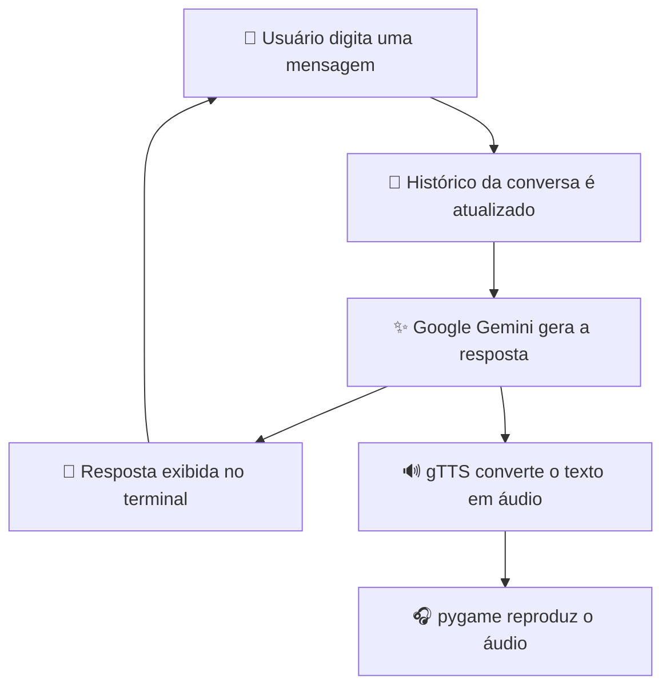

<div align="center">

# 💬 Chatbot Gemini com Voz

## Curso de Férias - Senai

**Chatbot interativo em Python com IA Generativa, histórico de conversa e síntese de voz**


</div>

---

## 📖 Sobre o projeto

Projeto prático desenvolvido durante o **curso de férias de Programação em Inteligência Artificial (Senai)**, como continuação dos fundamentos estudados no [primeiro repositório do curso](https://github.com/GalvaoLabs/programacao-ia-generativa).

Se naquele projeto o foco foi **entender** Ciência de Dados, Machine Learning e PLN, aqui o objetivo é **construir uma aplicação funcional**: um chatbot de terminal que conversa usando a **API do Google Gemini**, lembra do contexto da conversa e lê as respostas em voz alta.

## ✨ Funcionalidades

- 💬 Conversa interativa pelo terminal
- 🧠 Histórico de mensagens enviado a cada pergunta, mantendo o contexto
- 🔊 Síntese de voz em português do Brasil (gTTS)
- 🎧 Reprodução do áudio com pygame
- 🔐 Chave de API protegida por variável de ambiente (`.env`)
- 🚪 Encerramento digitando `sair`

## 📑 Sumário

- [Demonstração](#-demonstração)
- [Como funciona](#-como-funciona)
- [Estrutura do repositório](#-estrutura-do-repositório)
- [Tecnologias](#-tecnologias)
- [Como começar](#-como-começar)
- [Como usar](#-como-usar)
- [Segurança](#-segurança)
- [Solução de problemas](#-solução-de-problemas)
- [Melhorias futuras](#-melhorias-futuras)
- [Aprendizados](#-aprendizados)
- [Créditos](#-créditos)
- [Direitos e uso do material](#-direitos-e-uso-do-material)

---

## 🎬 Demonstração

Exemplo ilustrativo de uma conversa:

```text
==================================================
🤖 CHATBOT GEMINI
Digite 'sair' para encerrar.
==================================================

Você: Qual é a capital do Brasil?
🤖: A capital do Brasil é Brasília.

Você: E por que ela foi construída?
🤖: (o modelo entende que "ela" se refere a Brasília, graças ao histórico)

Você: sair
🤖 Até logo!
```

## 🔄 Como funciona



A cada pergunta, a aplicação envia ao Gemini **todo o histórico da conversa**, e não apenas a última mensagem. É isso que permite ao modelo responder com contexto. A resposta é guardada no histórico, exibida no terminal e convertida em áudio.

> O histórico existe apenas durante a execução e não é salvo ao encerrar o programa.

## 🗂️ Estrutura do repositório

```text
.
├── .env.example       # Modelo das variáveis de ambiente (sem chaves reais)
├── .gitignore         # Arquivos ignorados pelo Git (inclui o .env)
├── chatbot.py         # Código principal do chatbot
├── requirements.txt   # Dependências do projeto
└── README.md          # Documentação do projeto
```

## 🛠️ Tecnologias

| Tecnologia | Utilização |
|------------|------------|
| [Python](https://www.python.org/) | Linguagem principal |
| [Google Gemini](https://ai.google.dev/gemini-api/docs) | Geração de respostas com IA Generativa |
| [Google GenAI SDK](https://github.com/googleapis/python-genai) | Integração do Python com a API do Gemini |
| [python-dotenv](https://pypi.org/project/python-dotenv/) | Carregamento das variáveis de ambiente |
| [gTTS](https://pypi.org/project/gTTS/) | Conversão de texto em fala |
| [pygame](https://www.pygame.org/) | Reprodução do áudio gerado |

## 🚀 Como começar

### Pré-requisitos

- **Python 3.9 ou superior**
- **Git**
- Conexão com a internet (Gemini e gTTS são serviços online)
- Fones de ouvido ou caixa de som
- Uma **chave de API do Gemini**, gerada no [Google AI Studio](https://aistudio.google.com/apikey)

### 1. Clone o repositório

```bash
git clone https://github.com/GalvaoLabs/programacao-ia-generativa-2.git
cd programacao-ia-generativa-2
```

### 2. Crie e ative um ambiente virtual

```bash
python -m venv venv
```

```bash
# Windows
venv\Scripts\activate

# Linux/macOS
source venv/bin/activate
```

### 3. Instale as dependências

```bash
pip install -r requirements.txt
```

### 4. Configure a chave da API

Copie o arquivo de exemplo:

```bash
# Windows (PowerShell)
Copy-Item .env.example .env

# Linux/macOS
cp .env.example .env
```

Abra o `.env` e informe a sua chave:

```env
GEMINI_API_KEY=sua_chave_aqui
```

### 5. Execute

```bash
python chatbot.py
```

## 💬 Como usar

1. Digite uma mensagem quando aparecer `Você:`.
2. Leia a resposta no terminal e ouça o áudio.
3. Continue a conversa. O modelo lembra do que foi dito antes.
4. Digite `sair` para encerrar.

## 🔐 Segurança

A chave da API é uma **credencial sensível**. Por isso ela fica no arquivo `.env`, que está no `.gitignore` e **nunca é enviado ao GitHub**. Apenas o `.env.example`, sem chaves reais, é versionado.

**Boas práticas:**

- Nunca escreva a chave diretamente no código.
- Nunca faça commit do `.env`.
- Se uma chave for exposta, **revogue-a** no Google AI Studio e gere uma nova. Apagar o arquivo do repositório não basta, pois ele continua no histórico do Git.

## 🔧 Solução de problemas

| Problema | Possível causa e solução |
|----------|--------------------------|
| Chave de API inválida ou ausente | Confira se o `.env` existe na raiz do projeto e se a variável se chama exatamente `GEMINI_API_KEY` |
| `ModuleNotFoundError` | Ative o ambiente virtual e rode `pip install -r requirements.txt` |
| Erro ao acessar o Gemini | Verifique a conexão com a internet e se o modelo configurado em `chatbot.py` está disponível |
| Erro de cota ou limite de requisições | Aguarde alguns instantes e verifique os limites da sua chave |
| Áudio não é reproduzido | Verifique o dispositivo de saída de som e a instalação do pygame |
| Erro ao gerar o áudio | O gTTS precisa de conexão com a internet |

## 🚧 Melhorias futuras

- [ ] Salvar o histórico da conversa em arquivo
- [ ] Interface gráfica ou web (por exemplo, com Streamlit)
- [ ] Entrada por voz, com reconhecimento de fala
- [ ] Opção para ativar ou desativar a leitura em voz alta
- [ ] Definir uma personalidade ou instrução de sistema para o chatbot

## 🎯 Aprendizados

- Integração de aplicações Python com **APIs externas**
- Uso de **modelos de linguagem (LLMs)** e gerenciamento de **histórico e contexto**
- Uso de **variáveis de ambiente** e proteção de credenciais
- Conversão de **texto em fala** e reprodução de áudio
- Integração entre diferentes bibliotecas Python em uma aplicação interativa

## 🙏 Créditos

**Instrutor:** Johnny, [@TJfiles](https://github.com/TJfiles). Orientação, conteúdo e estrutura do projeto desenvolvido durante o curso.

**Desenvolvimento:** Miguel Henrique S. Galvão, [@GalvaoLabs](https://github.com/GalvaoLabs). Implementação da aplicação como atividade prática do curso.

**Tecnologias e serviços:** Google Gemini, Google AI Studio, Google GenAI SDK, gTTS, pygame e Python pertencem aos seus respectivos projetos e estão sujeitos às suas licenças e termos de uso.

## ⚖️ Direitos e uso do material

Este repositório tem **finalidade educacional e de portfólio**, como registro do projeto e dos conhecimentos adquiridos no curso. A estrutura, a orientação e os materiais didáticos fornecidos nas aulas pertencem aos seus respectivos autores. O código foi desenvolvido como atividade prática de aprendizagem.

Se você é responsável por algum material aqui presente e tem dúvidas ou solicitações, entre em contato pelo [GitHub](https://github.com/GalvaoLabs).

---

<div align="center">

**Python • IA Generativa • APIs • Síntese de voz**

</div>
